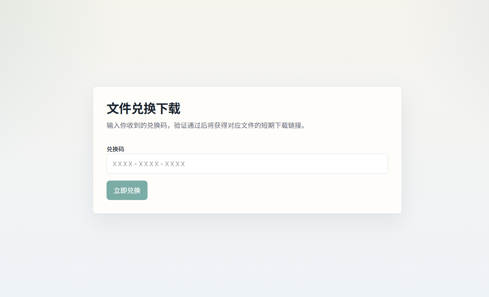
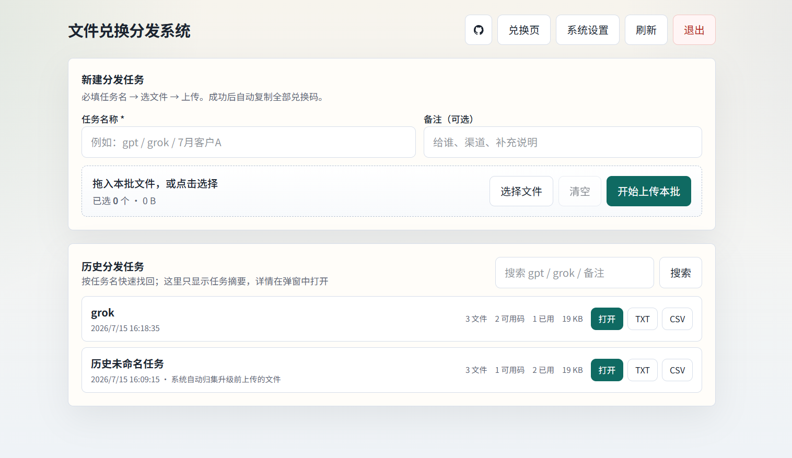

# 文件兑换分发系统

批量上传文件到 Cloudflare R2，自动生成兑换码；用户在前台输入兑换码后获得短期下载直链。

仓库：[lulistart/Files-hand-out](https://github.com/lulistart/Files-hand-out)

## 界面预览

### 前台兑换页



### 管理后台



## 功能

- 管理后台批量上传（zip / txt / 任意文件）
- 按任务名管理分发批次
- 每个文件自动生成兑换码
- 用户兑换后获取 R2 预签名下载链接
- 兑换码作废 / 重置
- CSV / TXT 导出
- 后台可配置 R2 与管理员密码
- 支持 Docker 部署

## 技术栈

- Next.js App Router
- SQLite（本地 / Docker）
- Cloudflare R2（S3 兼容预签名下载）
- JWT Cookie 管理端登录

## 本地开发

### 1. 安装依赖

如果本机走代理：

```powershell
$env:HTTP_PROXY="http://127.0.0.1:1080"
$env:HTTPS_PROXY="http://127.0.0.1:1080"
npm install
```

### 2. 配置环境变量

```powershell
copy .env.example .env.local
```

至少填写：

- `ADMIN_USERNAME` / `ADMIN_PASSWORD`
- `ADMIN_SESSION_SECRET`
- `R2_ACCOUNT_ID`
- `R2_ACCESS_KEY_ID`
- `R2_SECRET_ACCESS_KEY`
- `R2_BUCKET`

也可以启动后在后台「系统设置」里填写 R2 和管理员密码；数据库配置优先于环境变量。

### 3. 启动

```powershell
npm run dev
```

- 用户兑换页：`http://localhost:3000`
- 管理后台：`http://localhost:3000/admin`

## Docker 部署

适合 VPS / 本地服务器。使用本地 SQLite，数据落在 Docker volume。

### 1. 准备环境变量

```bash
cp .env.example .env
```

编辑 `.env`，至少设置管理员密码、`ADMIN_SESSION_SECRET`、R2 四项。

### 2. 启动

```bash
docker compose up -d --build
```

或使用 npm 脚本：

```bash
npm run docker:up
```

访问：

- 前台：`http://服务器IP:3000`
- 后台：`http://服务器IP:3000/admin`

### 3. 数据持久化

- SQLite 文件挂载在 volume：`distribute_data` → 容器内 `/app/data/distribute.db`
- 文件本体在 Cloudflare R2，不在容器磁盘

### 4. 常用命令

```bash
docker compose logs -f app
docker compose restart app
docker compose down
```

只构建镜像：

```bash
docker build -t files-hand-out .
docker run --rm -p 3000:3000 --env-file .env -v distribute_data:/app/data files-hand-out
```

## 使用流程

1. 登录 `/admin`
2. 填写任务名（如 `gpt` / `grok`）
3. 批量选择或拖拽文件
4. 点击「开始上传本批」
5. 复制兑换码或导出 TXT/CSV
6. 把兑换码发给对应用户
7. 用户在首页输入兑换码下载

## 项目结构

```text
.
├── Dockerfile
├── docker-compose.yml
├── .env.example
├── image/
│   ├── 前台.png
│   └── 后台.png
├── src/
│   ├── app/
│   │   ├── page.tsx              # 前台兑换页
│   │   ├── admin/                # 管理后台
│   │   └── api/                  # 接口
│   └── lib/                      # auth / db / r2 / settings
└── README.md
```

## API 摘要

### 管理端

- `POST /api/admin/login`
- `DELETE /api/admin/login`
- `GET/PUT /api/admin/settings`
- `POST /api/admin/uploads/server`
- `GET /api/admin/batches`
- `GET /api/admin/batches/:id/codes`
- `DELETE /api/admin/files/:id`
- `POST /api/admin/files/:id/code`（`revoke` / `regenerate`）
- `GET /api/admin/export/codes`
- `GET /api/admin/logs`

### 用户端

- `POST /api/redeem`

## 默认策略

| 项 | 默认 |
|---|---|
| 兑换码 | 单文件单码，默认 1 次 |
| 下载链接有效期 | 600 秒 |
| 单文件大小上限 | 500 MB |
| 存储 | Cloudflare R2 私有桶 + 预签名下载 |


